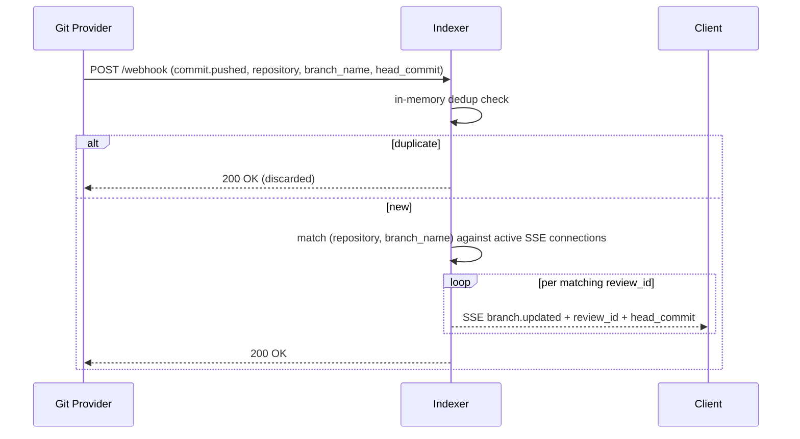
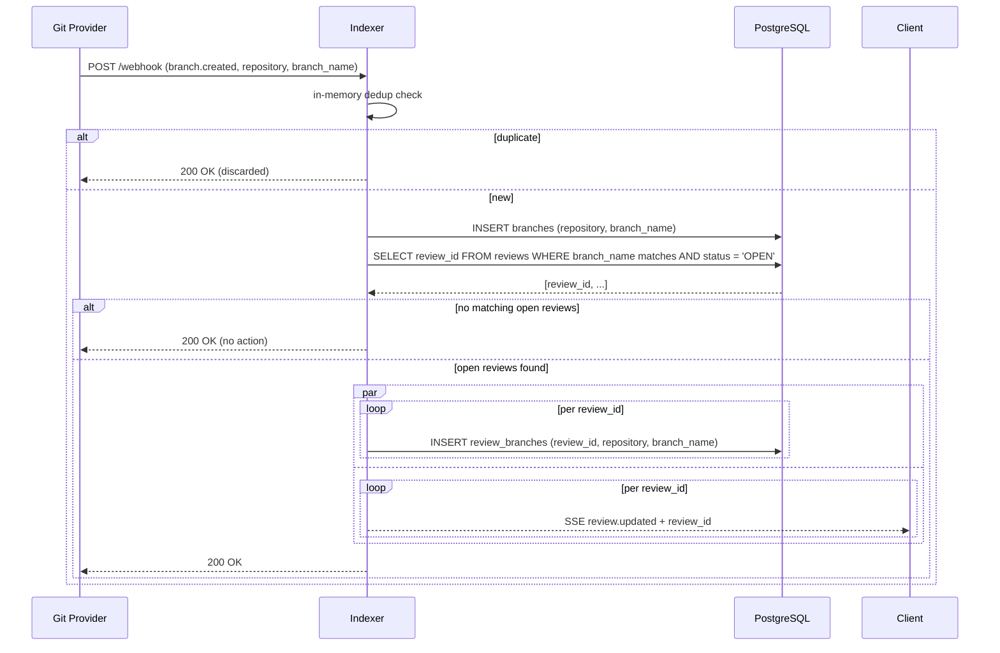
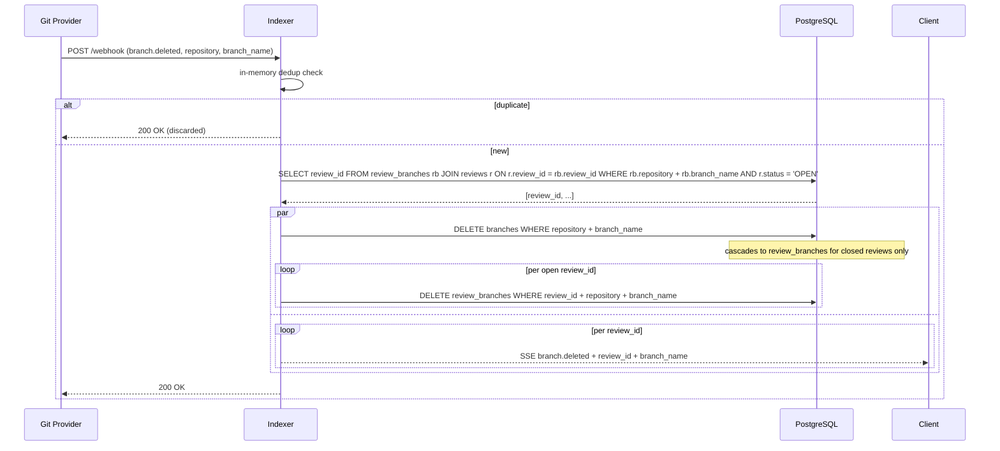
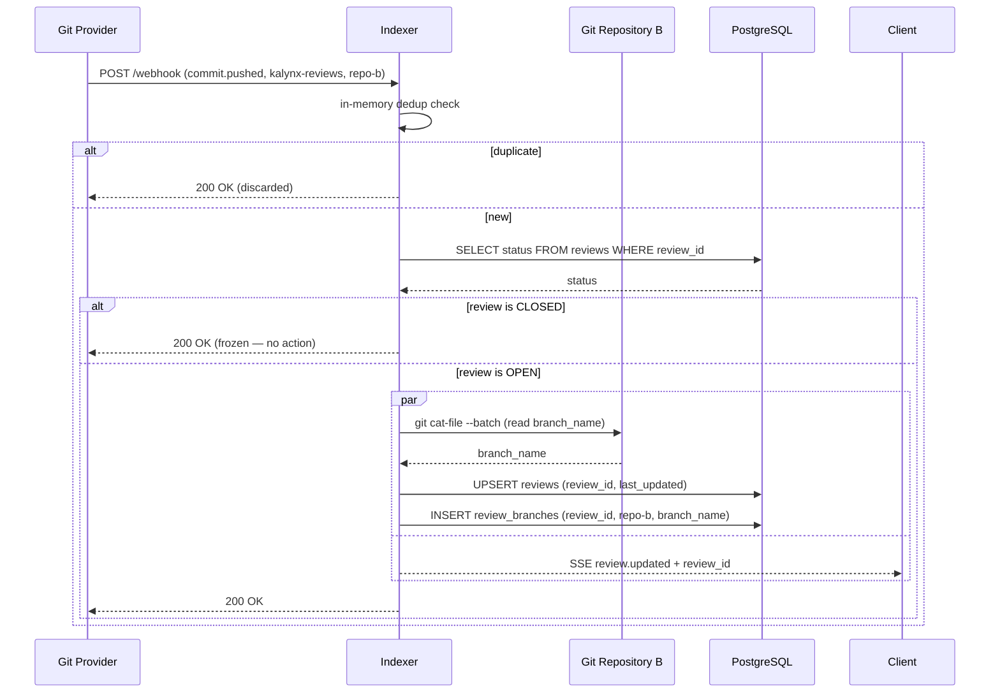
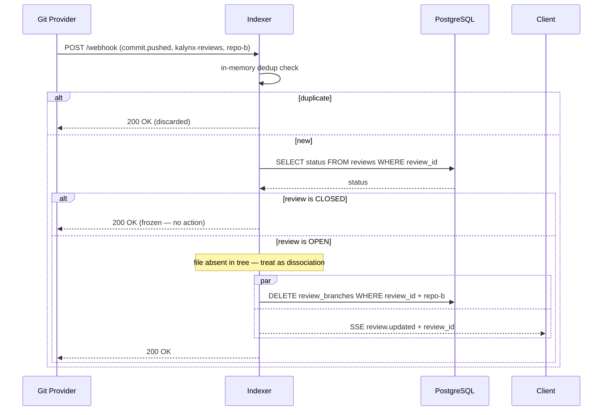

# Code Update Sequences

Covers webhook events that change what code is under review — which branches and repositories are associated, and when commits arrive. 

> **Closed reviews are frozen snapshots.** Any event that would modify or notify a closed review is skipped. The state at closure is preserved as-is.

---

## Commit Pushed

A commit is pushed to a tracked branch. The indexer matches the push against its in-memory registry of active client connections and fires SSE directly. No DB interaction.

---

## Branch Created

A new branch appears in a tracked repository. The indexer records it and checks whether any open reviews should now be associated with it.

---

## Branch Deleted

A branch is deleted from a tracked repository. Open reviews watching it are notified and their association removed. Closed reviews are left untouched — the snapshot is preserved.

---

## Repository Associated to Review

The same review file (same `review_id`) appears in an additional repository's `kalynx-reviews` branch, linking that repo's branch to the review. Skipped if the review is closed.

---

## Repository Dissociated from Review

The review file is deleted from a repository's `kalynx-reviews` branch. Skipped if the review is closed — the frozen snapshot retains the association.

