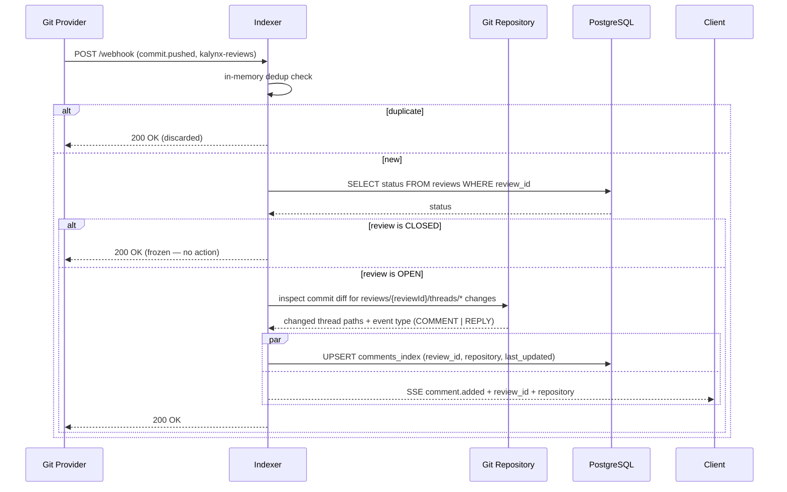
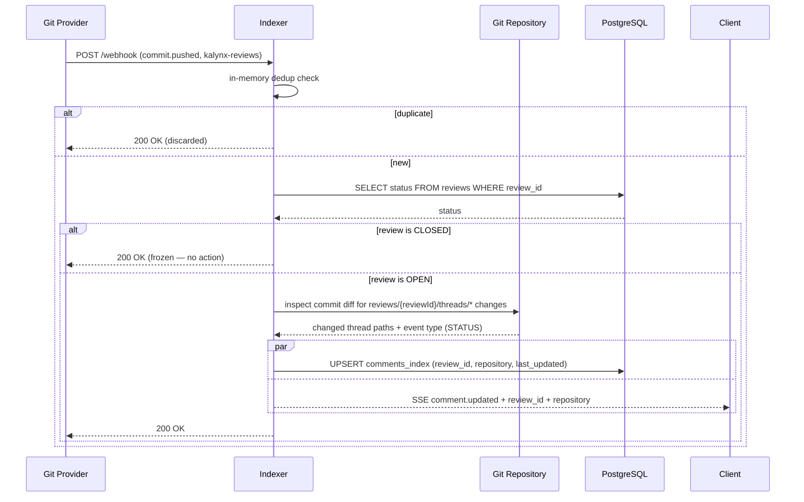

# Comment Update Sequences

Covers webhook events that change comment state on a review. All comment events arrive via a push to the `kalynx-reviews` orphan branch of the repository the review belongs to. The indexer detects which `reviews/{reviewId}/threads/*` paths changed in the commit tree to determine what happened.

> **Closed reviews are frozen.** Comment events for closed reviews are discarded — the snapshot at closure is preserved.

---

## Comment Added

A new thread file appears under `reviews/{reviewId}/threads/`, or an existing thread file gains a new `COMMENT` or `REPLY` event line. The indexer fires `comment.added` immediately and updates the routing index.

**Client action on `comment.added`**: Re-read all thread blobs for the review from the blobless clone (`git ls-tree` + `git cat-file --batch`). Refresh the comment panel.

---

## Comment Status Updated

An existing thread file gains a new `STATUS` event line (resolution toggled). No new comment is added; only the resolved state changes.

**Client action on `comment.updated`**: Re-read all thread blobs for the review from the blobless clone. Refresh the comment panel.

---

## How the Indexer Distinguishes Event Types

When a `kalynx-reviews` push arrives, the indexer reads the diff between the new commit and its parent to identify changed paths under `reviews/{reviewId}/threads/`. For each changed thread file it reads the last event line appended:

| Last event `type` in changed thread | SSE event fired |
|---|---|
| `COMMENT` | `comment.added` |
| `REPLY` | `comment.added` |
| `STATUS` | `comment.updated` |

If multiple threads change in a single commit (e.g. a batch resolve), the indexer fires one SSE event per `reviewId` — it does not fire per-thread.
