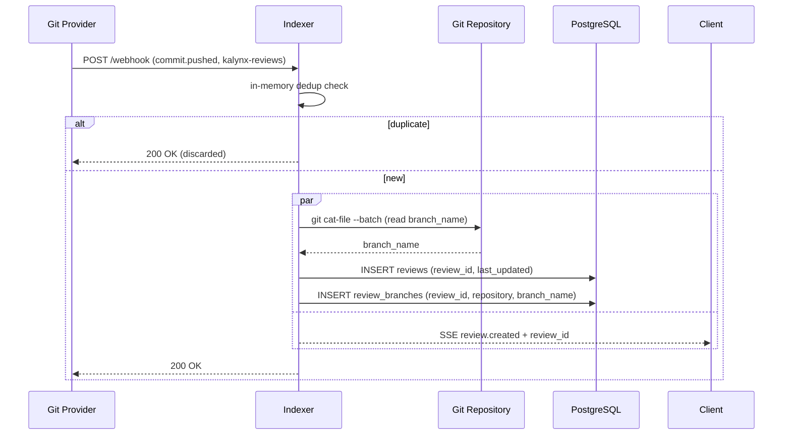
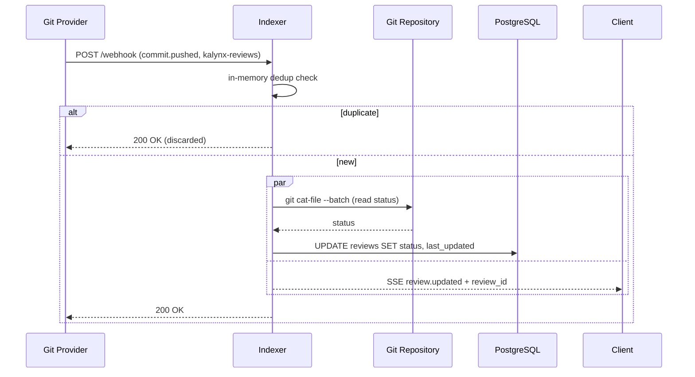

# Review Update Sequences

Covers webhook events that change review metadata. All events arrive on the `kalynx-reviews` orphan branch.

---

## Review Created

A new review file appears in the commit tree. SSE fires immediately — the git read for `branch_name` happens in parallel to populate `review_branches`.

---

## Review Status Updated

An existing review file is updated on the `kalynx-reviews` branch. SSE fires immediately — the git read for status happens in parallel to keep the DB filter index current.

