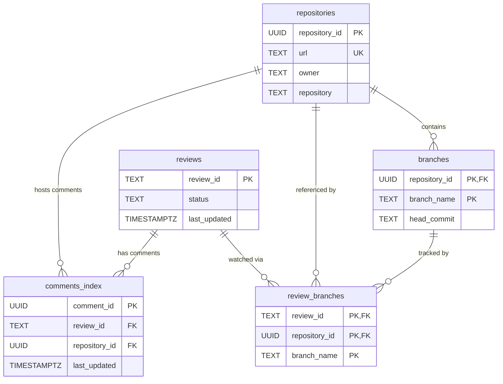

# Central Indexer — Database Storage Design

## Technology

PostgreSQL via a custom blocking JDBC connection pool (`ConnectionPool`, pool size configured in `config.json`, default 20). `pg_notify` is used for SSE fan-out — all writes notify `ListenThread`, which forwards to open SSE connections.

---

## Schema

### Tables

#### repositories
Required to let the client know what repositories to query for more detail. `repository_id` is a surrogate UUID primary key — stable even if the repository is renamed or migrated to a different host. `url` carries a `UNIQUE` constraint and is the field used in all API responses and SSE payloads; the surrogate key stays internal to the DB.

#### branches
Required to let the client determine code changes and to track branch head commits for review updates.

#### review_branches
Required to let the client determine which branches are being watched by a review.

#### reviews
Required to let the client determine which reviews are being watched.

#### comments_index
A change-notification table. One row per comment. `comment_id` is the UUID v7 generated by the client at comment creation — matches the identifier in the git storage path `reviews/{reviewId}/comments/{commentId}/`. `review_id` and `repository_id` are FK columns indexed for fast lookup by review. The SSE event carries `repository_url` (looked up from `repositories`) and `comment_id` so the client can read the three sub-streams (`metadata`, `text`, `status`) from the correct repository clone. Comment content is always read from git, never stored here. See [`ServerlessReviewTool/Documentation/Design/comments.md`](../../../../ServerlessReviewTool/Documentation/Design/comments.md) for full design.

---

## Entity Relationship Diagram



---

## Read-Optimized Index (reviews_index)

Keep the normalized tables but maintain a denormalized read table that serves `GET /reviews` with low latency.

**Schema:**

```sql
CREATE TABLE IF NOT EXISTS reviews_index (
    review_id TEXT PRIMARY KEY,
    status TEXT NOT NULL,
    last_updated TIMESTAMPTZ NOT NULL,
    repositories JSONB
);
```

**Indexes:**

```sql
CREATE INDEX IF NOT EXISTS idx_reviews_index_last_updated
    ON reviews_index (last_updated DESC);

CREATE INDEX IF NOT EXISTS idx_reviews_index_repositories_gin
    ON reviews_index USING GIN (repositories);
```

**JSONB Structure:**

The `repositories` JSONB column stores a denormalized array with complete branch information. `url` is included here so the client has it without a join; `repository_id` is omitted (internal key only).

```json
[
  {
    "owner": "alice",
    "repository": "repo-a",
    "repositoryUrl": "https://github.com/alice/repo-a",
    "branchName": "main",
    "headCommit": "c0ffee123"
  },
  {
    "owner": "alice",
    "repository": "repo-a",
    "repositoryUrl": "https://github.com/alice/repo-a",
    "branchName": "develop",
    "headCommit": "deadbeef456"
  }
]
```

**Maintenance:**

- The indexer upserts this denormalized JSON on every review event
- Array entries are deterministically sorted by `owner`, `repository`, `branchName`
- Mapping logic is in `ReviewsIndexMapper.toRepositoriesJson()`
- When a repository URL changes, update `repositories.url` and re-denormalize affected `reviews_index` rows
